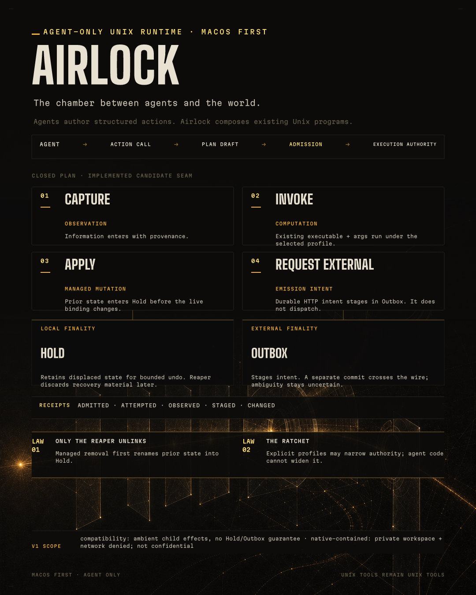

# Airlock architecture infographic

This bundle explains one question:

> How does an agent request ordinary Unix work through Airlock, and where do
> authority, recovery, staging, and evidence enter?



## Artifacts

- `airlock-architecture-v1.typ` — editable deterministic composition.
- `airlock-architecture-v1.png` — rendered 1080×1350 infographic.
- `assets/airlock-architecture-plate-v1.png` — text-free generated plate.
- `airlock-architecture-v1.alt.txt` — accessibility companion.
- `evidence.md` — claim provenance, caveats, visual provenance, and review.

## Render

The composition imports the canonical Ether Typst tokens and fonts from the
sibling `../ether` repository. From the Airlock repository:

```sh
typst compile \
  --root .. \
  --font-path ../ether/brand-studio/fonts \
  --ignore-system-fonts \
  docs/infographics/airlock-architecture-v1.typ \
  docs/infographics/airlock-architecture-v1.png \
  --format png \
  --ppi 72
```

The Ether stage uses points at 72 PPI, so the 1080pt × 1350pt page renders to
exactly 1080 × 1350 pixels.

The plate is intentionally text-free. All architecture claims are composed in
Typst so spelling, hierarchy, and revision remain deterministic.
